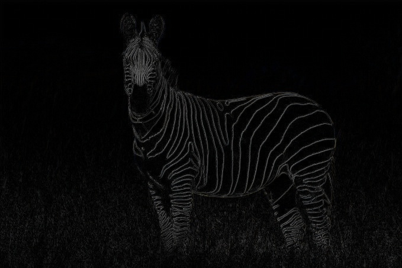
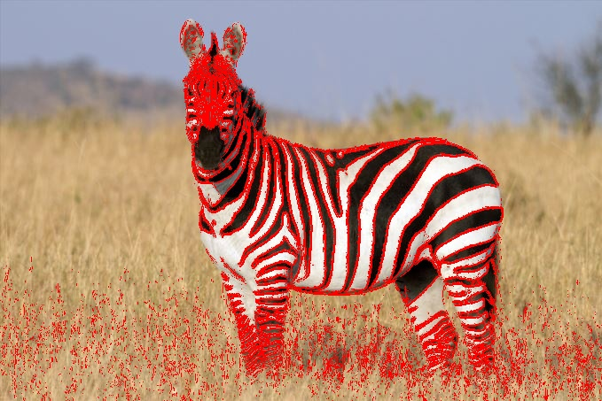
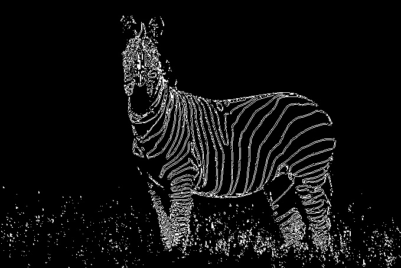
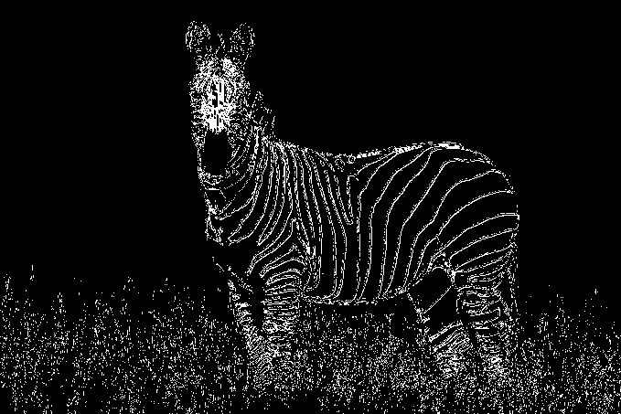
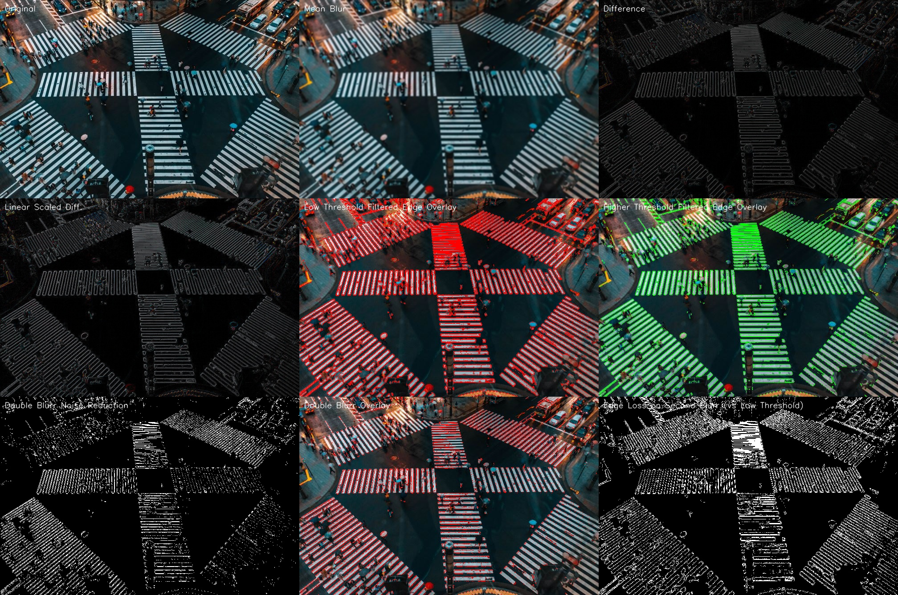

# Edge Detection

## Mean Blurr Edge Detection

If we were to consider that a pixel belongs to an edge if it is notably different from its surroundings.\
Considering that, when an image is blurred, a pixel should change most when the adjacent pixels are most different from itself.\
Could we then approach this by blurring an image and comparing each pixel with it's own blurred self, as a measure of how likely it'd be for it to be an edge pixel?\
\
Let's see what happens when we try it with this zebra\
\
\
Blurr it, setting each pixel equal to the mean of those pixels around it\
\
\
Compute the difference between each original pixel and its blurred self\
\
\
Let's apply a linear scale filter so that we use the entire 8bit range of each pixel.\
Thus, enhancing the gap between those pixels which where most different from those which were just a little.\
\
\
It looks like the edges on the zebra's contour and lines can be detected well enough, but what about the grass?\
It surely is producing a lot of noise, although these unwanted edges seem to be less intense.\
Let's then apply a filter, so that we only keep those edges whose intensity exceeds a certain thershold.\
\
\
It's seems we've reduced quite a lot of noise from the grass.\
But some weaker edges around the zebra have also disappeared.\
Fine tunning this threshold can reduce the grass edges quite a bit without damaging those of the zebra too much.\
But it seems we'll have to deal with some loss on our protagonist either way.\
Let's see those edges over the original image.\
\
\
\
Looks like the grass under the zebra's shadow provides much stronger edges which won't easily go away using this method.\
\
This doesn't look too bad, but can we do anything to reduce the grass noise further without hurting those edges of the zebra which we'd like to keep?\
Most of the "edges" produced by the grass are isolated pixels... but the zebra's edges are continous, or less isolated.\
What if we apply a second blurr, in an attempt to reduce those isolated "edges", and then apply another threshold to get rid of the weakest ones?\
\
\
It doesn't look too promising.\
A lot of detail was lost around the zebra's face, and the zebra's lines edges have doubled.\
Let's see an overlay.\

\
And... it does in fact look not good at all.\
Let's see how much of the fisrt-attempt edges have been lost due to the second blurr.\
\
A great deal of grass edges were loss (or rather, displaced) but so were the zebra's edges.\
So... this won't do.\
But the first approach was better than I expected. Not too bad.\
\
Let's compare it to OpenCV's Canny edge detection.\

\
Now that is much nicer!\
\
But I still wonder if a Gaussian mean or different paramenters could make for a better Blurr Edge Detection algorithm...\
This was a funny idea that came to mind, and turned out to be a nice and fun little project :)
\
\
\
This are the results on a few other images:
\
\
\
\
