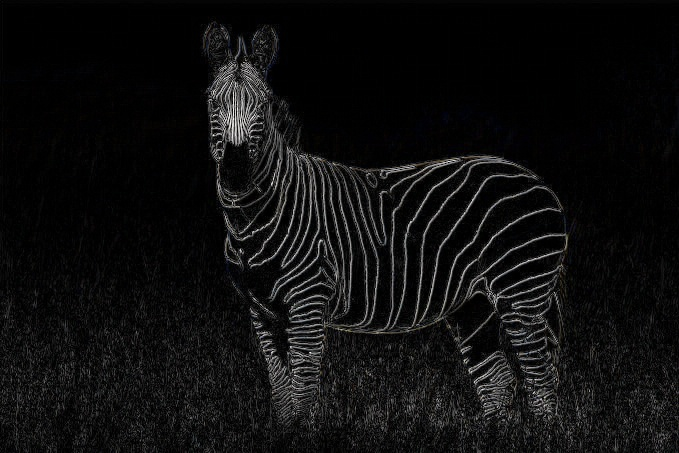

# Edge Detection

## Mean Blurr Edge Detection

If we were to consider that a pixel belongs to an edge if it is notably different from its surroundings.\
Considering that, when an image is blurred, a pixel should change most when the adjacent pixels are most different from itself.\
Could we then approach this by blurring an image and comparing each pixel with it's own blurred self, as a measure of how likely it'd be for it to be an edge pixel?\
\
Let's see what happens when we try it with this image:\
\
\
Blurr it, setting each pixel equal to the mean of those pixels around it:\
\
\
Compute the difference between each original pixel and its blurred self\
\
\
Let's apply a linear scale so that we use the entire 8bit range of each pixel.\
Thus, enhancing the gap between those pixels which where most different from those which were just a little\
\
\
It looks like the edges on the zebra's contour and lines can be detected well enough, but what about the grass?\
It surely is producing a lot of noise, although these unwanted edges seem to be less intense.\
Let's then apply a filter, so that we only keep those edges whose intensity exceeds a certain thershold.\
\
\
Let's see those edges over the original image.\
\
